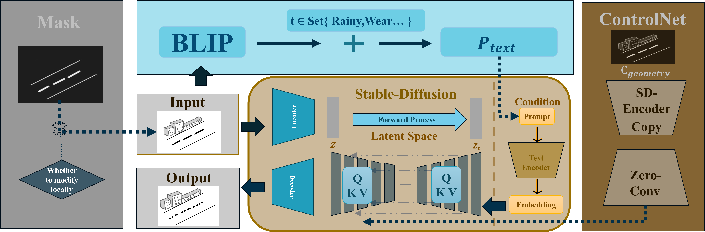
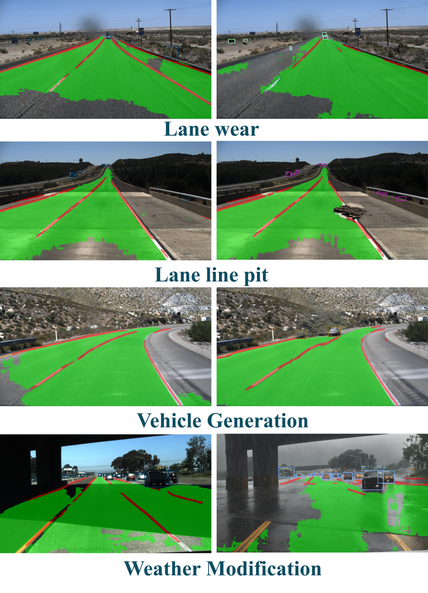

# CADiffusion

## Abstract
Adversarial example generation is crucial for accelerating 
the testing of autonomous vehicles (AVs). 
With the introduction of end-to-end AVs, 
adversarial images are becoming more important than 
adversarial behavior attacks, as perception and decision-making 
no longer have explicit information transmission. Generative 
AI-based methods show promising results when generating new images.
However, they are usually hardly controllable and struggle with 
semantic consistency in generated images. In this paper, 
we focus on lane detection as an example and integrate a control 
network along with a bootstrapped language-image pretraining model
into the stable diffusion framework to enhance the controllability 
and realism of generated adversarial examples. Leveraging the 
PBLMD dataset, we successfully generate diverse adversarial 
examples such as occluded and worn lane lines. Experimental 
results demonstrate that these examples reduce the lane detection 
performance of YOLOP by an average of 11\% while maintaining high 
fidelity, demonstrating the approach's efficacy. 

## Framework

The CADiffusion framework first extracts a region mask and optionally 
applies local modifications. A BLIP model fuses the mask with 
predefined scene labels (e.g., rain) to form a text prompt 
$P_{\text{text}}$, while ControlNet encodes geometric 
information) $C_{\text{geometry}}$. These conditions steer a 
Stable Diffusion U-Net: the forward diffusion adds noise and the 
decoder denoises latent representations, and a cross-attention 
module (with projections $Q,K,V$ integrates $P_{\text{text}}$ 
and $C_{\text{geometry}}$ to reconstruct the adversarial image. 
This pipeline preserves the original road structure and enables 
fine generation of physical attacks under varied environmental 
conditions.

## Dataset
| Name           | Size | URL                                                                            |
|----------------|------|--------------------------------------------------------------------------------|
| PBLMD_TuSimple | 33   | [Github](https://github.com/ADSafetyJointLab/PBLMD/tree/main/dataset/TuSimple) |
## Main Functions

### 1. Vehicle Generation (lane_car.py)
 

### 2. Weather Change (lane_environmental.py)
 
### 3. Poles Generation (lane_kengdao.py)
 
### 4. Wear Generation (lane_mohu.py)
 


## Install
```bash
# Clone
git clone https://github.com/yourusername/lane-processing-toolkit.git
cd lane-processing-toolkit

#  Requirements
pip install -r requirements.txt

# Download SD model
# put .safetensors model file into CADiffusion folder
```
## Contrast with YOLOP

We use [YOLOP](https://github.com/hustvl/YOLOP) as the detection standard to examine the changes 
in recognition ability before and after enhancement.


